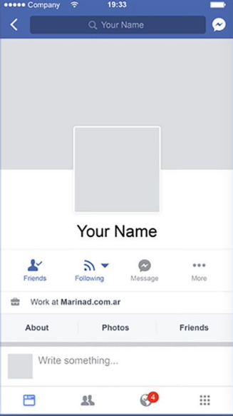

<h1>რა არის ფლატერი</h1>
<p>მოკლე ისტორია/აღწერა</p>

<h1>რა შეუძლია ფლატერს</h1>
<p>showcase</p>

<h1>შავი ყუთები</h1>


```dart
import 'package:flutter/material.dart';

void main() {
  runApp(MaterialApp(
    title: 'Flutter Demo',
    theme: ThemeData(primarySwatch: Colors.blue),
    debugShowCheckedModeBanner: false,
    home: const HomePage(),
  ));
}

class HomePage extends StatelessWidget {
  const HomePage({Key? key}) : super(key: key);

  @override
  Widget build(BuildContext context) {
    return Scaffold(
      appBar: AppBar(
        title: const Text('Post'),
      ),
      body: Text('Your code goes here...'),
    );
  }
}

```