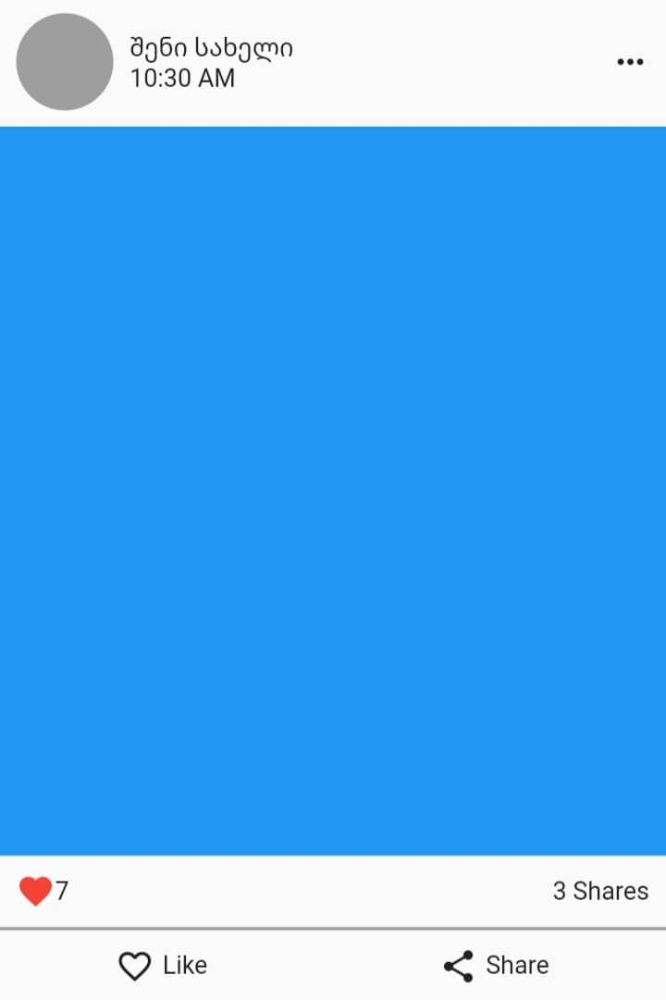

<h1>რა არის ფლატერი</h1>
<p>მოკლე ისტორია/აღწერა</p>

<h1>რა შეუძლია ფლატერს</h1>
<p>showcase</p>

<h1>შავი ყუთი</h1>


```dart
import 'package:flutter/material.dart';

void main() {
  runApp(MaterialApp(
    title: 'Flutter Demo',
    theme: ThemeData(primarySwatch: Colors.blue),
    debugShowCheckedModeBanner: false,
    home: const HomePage(),
  ));
}

class HomePage extends StatelessWidget {
  const HomePage({Key? key}) : super(key: key);

  @override
  Widget build(BuildContext context) {
    return Scaffold(
      body: SafeArea(
// ადგილი სადაც ჩვენს კოდს დავწერთ
      )
    );
  }
}

```

<h1>მწკრივები და სვეტები</h1>
<p>ლეიაუთების აწყობისთვის მნიშვნელოვანია, წინასწარ წარმოვიდგინოთ როგორ განვალაგებთ არსებულ ელემენტებს ეკრანზე</p>

<p>ფლატერი ელემენტების პოზიციონირებისთვის გვაძლევს სხვადასხვა ვიჯეტს. დღეს გამოვიყენებთ ასეთ ორ ვიჯეტს: Column, Row. შემდეგ გაკვეთილებში მათ დეტალურად განვიხილავთ, ჯერჯერობით კი მათ ძირითად ფუნქციებზე: ელემენტების მწკრივებად და სვეტებად განლაგებაზე ვისაუბრებთ</p>


<ul>
  <li>Row - ელემენტებს მწკრივზე ანაწილებს</li>
  <li>Column - ელემენტებს სვეტზე ანაწილებს</li>
</ul>


<h1>ჩვენი დაწერილი კოდი სრულად</h1>

```dart
child: Column(
    children: [
      Container(
        margin: const EdgeInsets.all(10),
        child: Row(
          mainAxisAlignment: MainAxisAlignment.spaceBetween,
          children: [
            Row(
              children: [
                const CircleAvatar(
                  backgroundColor: Colors.grey,
                  radius: 30.0,
                ),
                const SizedBox(
                  width: 10.0,
                ),
                Column(
                  crossAxisAlignment: CrossAxisAlignment.start,
                  children: const [
                    Text('შენი სახელი'),
                    Text('10:30 AM'),
                  ],
                ),
              ],
            ),
            const Icon(Icons.more_horiz)
          ],
        ),
      ),
      Container(
        width: double.infinity,
        height: 450,
        color: Colors.blue,
      ),
      Container(
        margin: const EdgeInsets.all(10),
        child: Row(
          mainAxisAlignment: MainAxisAlignment.spaceBetween,
          children: [
            Row(
              children: const [
                Icon(
                  Icons.favorite,
                  color: Colors.red,
                ),
                Text('7')
              ],
            ),
            const Text('3 Shares')
          ],
        ),
      ),
      Container(
        height: 2,
        width: double.infinity,
        color: Colors.grey,
      ),
      const SizedBox(
        height: 10,
      ),
      Row(
        mainAxisAlignment: MainAxisAlignment.spaceAround,
        children: [
          Row(
            children: const [
              Icon(Icons.favorite_border),
              SizedBox(width: 5),
              Text('Like'),
            ],
          ),
          Row(
            children: const [
              Icon(Icons.share),
              SizedBox(width: 5),
              Text('Share'),
            ],
          ),
        ],
      )
    ],
  ),


```